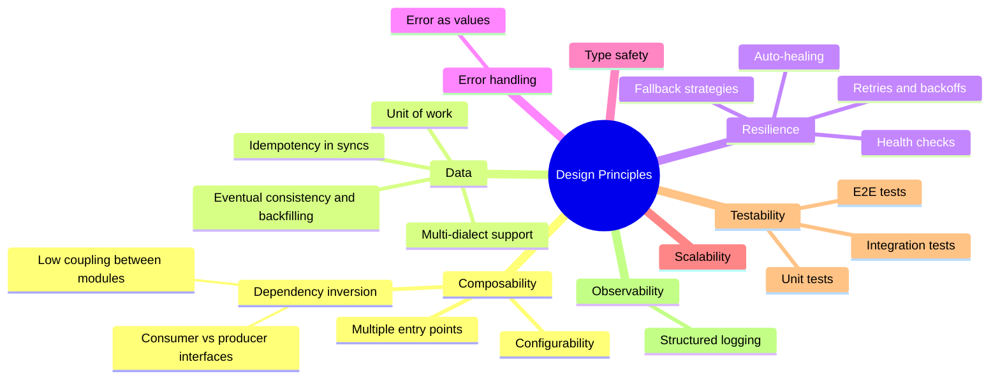

# Labeling Platform - Key Design Principles

```mermaid
mindmap
  root((Design Principles))
    Composability
        Dependency inversion
            Consumer vs producer interfaces
            Low coupling between modules
        Multiple entry points
        Configurability
    Data
        Unit of work
        Multi-dialect support
        Idempotency in syncs
        Eventual consistency and backfilling
    Resilience
        Fallback strategies
        Retries and backoffs
        Auto-healing
        Health checks
    Error handling
        Error as values
    Type safety
    Scalability
    Testability
        Unit tests
        Integration tests
        E2E tests
    Observability
        Structured logging
```