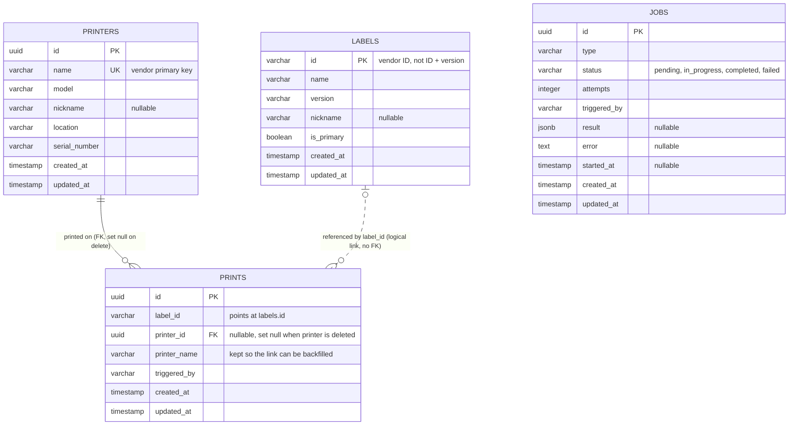

# Labeling Platform - Database ERD

```mermaid
erDiagram
    PRINTERS ||--o{ PRINTS : "printed on (FK, set null on delete)"
    LABELS |o..o{ PRINTS : "referenced by label_id (logical link, no FK)"

    PRINTERS {
        uuid id PK
        varchar name UK "vendor primary key"
        varchar model
        varchar nickname "nullable"
        varchar location
        varchar serial_number
        timestamp created_at
        timestamp updated_at
    }

    LABELS {
        varchar id PK "vendor ID, not ID + version"
        varchar name
        varchar version
        varchar nickname "nullable"
        boolean is_primary
        timestamp created_at
        timestamp updated_at
    }

    PRINTS {
        uuid id PK
        varchar label_id "points at labels.id"
        uuid printer_id FK "nullable, set null when printer is deleted"
        varchar printer_name "kept so the link can be backfilled"
        varchar triggered_by
        timestamp created_at
        timestamp updated_at
    }

    JOBS {
        uuid id PK
        varchar type
        varchar status "pending, in_progress, completed, failed"
        integer attempts
        varchar triggered_by
        jsonb result "nullable"
        text error "nullable"
        timestamp started_at "nullable"
        timestamp created_at
        timestamp updated_at
    }
```
