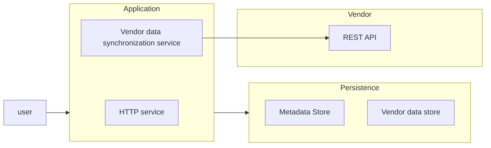

```mermaid
flowchart LR

    user["user"]

    subgraph app["Application"]
        rest["HTTP service"]
        syncer["Vendor data synchronization service"]
    end

    subgraph persistence["Persistence"]
        metadata["Metadata Store"]
        vendor["Vendor data store"]
    end

    subgraph vendorapp["Vendor"]
        api["REST API"]
    end

    user -->
    app --> persistence
    syncer --> api

```
