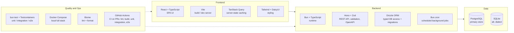

# Labeling Platform - Tech Stack (high level)

```mermaid
flowchart LR
    subgraph FE["Frontend"]
        direction TB
        f1["React + TypeScript<br/>SPA UI"]
        f2["Vite<br/>build / dev server"]
        f3["TanStack Query<br/>server-state caching"]
        f4["Tailwind + DaisyUI<br/>styling"]
    end
    subgraph BE["Backend"]
        direction TB
        b1["Bun + TypeScript<br/>runtime"]
        b2["Hono + Zod<br/>REST API, validation, OpenAPI"]
        b3["Drizzle ORM<br/>typed DB access + migrations"]
        b4["Bun.cron<br/>scheduled background jobs"]
    end
    subgraph DATA["Data"]
        d1[("PostgreSQL<br/>primary store")]
        d2[("SQLite<br/>alt. dialect")]
    end
    subgraph OPS["Quality and Ops"]
        direction TB
        o1["bun test + Testcontainers<br/>unit / integration / e2e"]
        o2["Docker Compose<br/>local full stack"]
        o3["Biome<br/>lint + format"]
        o4["GitHub Actions<br/>CI on PRs: lint, build, unit, integration, e2e"]
    end
    FE --> BE --> DATA
    OPS -.-> FE
    OPS -.-> BE
```
